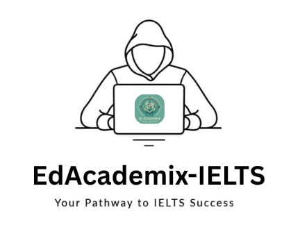

<p align="center">
  
</p>

<h1 align="center">EdAcademix</h1>

<p align="center">
  A study-abroad discovery and IELTS preparation platform for students planning their international education journey.
</p>

<p align="center">
  
  
  
  
</p>

## About EdAcademix

EdAcademix is a student-focused web platform that combines international university research, personalized university discovery, IELTS preparation, mock testing, performance tracking, and admission-support workflows in one place. It is designed primarily for Bangladeshi students exploring higher-education opportunities abroad.

The platform covers universities in Australia, England, Germany, Italy, and the United States, while its IELTS module provides learning resources and assessments for Listening, Reading, Writing, and Speaking.

## Key features

### Study-abroad discovery

- Country guides for Australia, England, Germany, Italy, and the United States
- Profiles for 20 international universities
- University rankings and location information
- Undergraduate, graduate, and PhD program listings
- Subject and field-of-study exploration
- Tuition-fee information
- Admission requirements
- Scholarship information
- Preferred-university matching by country, program level, and language score
- Search and comparison-oriented navigation

### IELTS preparation

- Dedicated Listening, Reading, Writing, and Speaking learning sections
- Section-specific tips and preparation material
- Lecture-video catalog backed by the database
- IELTS-focused chatbot assistance
- Authenticated student dashboard
- Performance summaries and score trends

### IELTS mock tests

- Multiple Listening test sets with audio-based questions
- Reading passages and section-based questions
- Writing Task 1 and Task 2 responses
- AI-assisted writing evaluation through OpenRouter
- Live Speaking tests through Jitsi Meet
- Automatic Listening and Reading scoring
- IELTS-style band-score calculation
- Stored answers, results, feedback, and attempt history

### Student services

- Secure account registration and login
- Password hashing and session-based authentication
- Personal dashboard with section-wise performance
- Certificate application for eligible learners
- PDF certificate generation with FPDF
- University offer-letter request workflow
- Supporting-document uploads
- Contact and feedback form

### Administration

- Separate administrator authentication
- Registered-user management
- Student test, response, and result inspection
- Individual performance reports and charts
- Live Speaking-test monitoring and examiner access
- Manual Speaking band-score and feedback entry
- Certificate-request review
- Offer-letter request and document review
- Contact-message management

## Technology stack

| Area | Technology |
| --- | --- |
| Backend | PHP and MySQLi |
| Database | MySQL or MariaDB |
| Frontend | HTML, CSS, JavaScript, Bootstrap 5 |
| UI assets | Font Awesome and Google Fonts |
| Authentication | PHP sessions and `password_hash()` |
| Charts | Chart.js |
| AI evaluation | OpenRouter API with a configurable DeepSeek model |
| Live speaking | Jitsi Meet External API |
| PDF generation | FPDF and TCPDF |
| Dependency management | Composer |
| Local environment | XAMPP / Apache |

## Getting started

### Prerequisites

- XAMPP with Apache and MySQL/MariaDB
- PHP 8 or newer with `mysqli` and `curl` enabled
- Composer
- A modern web browser
- An OpenRouter API key for AI writing evaluation
- Internet access for OpenRouter, Jitsi Meet, fonts, and CDN-hosted assets

### 1. Clone the repository

Clone EdAcademix into XAMPP's `htdocs` directory:

```cmd
cd /d C:\xampp\htdocs
git clone https://github.com/tahmidd01/EdAcademix.git
cd EdAcademix
```

### 2. Install PHP dependencies

The `vendor/` directory is intentionally excluded from Git:

```cmd
composer install
```

If Composer is not available globally, use the bundled Composer executable:

```cmd
php composer.phar install
```

### 3. Start Apache and MySQL

Open the XAMPP Control Panel and start:

- Apache
- MySQL

### 4. Prepare the database

Create a MySQL database named `edacademix`:

```sql
CREATE DATABASE edacademix
  CHARACTER SET utf8mb4
  COLLATE utf8mb4_unicode_ci;
```

The current repository does **not** include a database schema export. Import a sanitized EdAcademix database export before running the application. A functional installation requires the following main tables and their related data:

```text
Users
admin
CountryList
University
Program
admissionrequirements
fieldofstudy
tuitionfee
UniversityProgramField
sectionvideos
questions
reading_passages
listeningaudio
writingtasks
tests
testresponses
testresults
writingresponses
speaking_sessions
certificate_info
offer_letter_requests
contact_messages
```

Listening, Reading, Writing, university-search, and course-video features require their corresponding seed records. When adding an SQL export to the repository, include structure and non-sensitive seed content only—never real user accounts, test responses, contact messages, or uploaded documents.

### 5. Configure the database connection

Update `connect.php` if your MySQL settings differ from XAMPP's defaults:

```php
$host = 'localhost';
$dbname = 'edacademix';
$username = 'root';
$password = '';
```

For deployment, move database credentials into environment variables rather than committing them to source control.

### 6. Configure AI writing evaluation

Create an ignored `.env` file in the project root:

```env
DEEPSEEK_API_KEY=your_new_openrouter_api_key
DEEPSEEK_MODEL=deepseek/deepseek-chat:free
```

Never hard-code the API key in a PHP file. The writing-submission code reads `DEEPSEEK_API_KEY` and `DEEPSEEK_MODEL` from the environment. The project includes `vlucas/phpdotenv`; ensure your application bootstrap loads it when using a local `.env` file:

```php
require_once __DIR__ . '/vendor/autoload.php';

$dotenv = Dotenv\Dotenv::createImmutable(__DIR__);
$dotenv->safeLoad();
```

This can be placed near the beginning of `connect.php`, before pages attempt to read `$_ENV`.

### 7. Supply local learning media

The large `Videos/` and `Audio/` directories are excluded from Git to keep the repository manageable. Add the required media locally or replace the database paths with hosted media URLs.

Course videos are read from `sectionvideos.video_path`. Listening tests read their audio paths from `listeningaudio.AudioFilePath`. For the existing Listening sets, the expected local structure follows this pattern:

```text
EdAcademix/
├── Audio/
│   ├── listening_set1.mp3
│   ├── listening_set2.mp3
│   └── listening_set3.mp3
└── Videos/
    └── ... course video files ...
```

### 8. Run the application

Open:

```text
http://localhost/EdAcademix/
```

Useful routes:

| Route | Purpose |
| --- | --- |
| `/signup.php` | Student registration |
| `/login.php` | Student login |
| `/dashboard.php` | IELTS dashboard and progress |
| `/tests.php` | IELTS mock-test selection |
| `/Preferred_university.php` | University recommendation form |
| `/offerletter.php` | Offer-letter request form |
| `/Admin/admin_signup.php` | Initial administrator registration |
| `/Admin/admin_login.php` | Administrator login |

Disable public administrator registration after creating the first administrator account.

## IELTS assessment flow

```text
Student account
    ↓
Preparation material and lecture catalog
    ↓
Listening / Reading / Writing / Speaking test
    ↓
Automatic scoring or examiner/AI evaluation
    ↓
Stored result, feedback, and dashboard analytics
    ↓
Certificate eligibility when the overall average reaches Band 6.0
```

## Project structure

```text
EdAcademix/
├── Admin/                   # Admin portal and review workflows
├── Courses/                 # IELTS courses and preparation tips
├── Tests/                   # IELTS tests, submissions, and scoring
├── universities/            # Individual university pages and assets
├── css/, js/, webfonts/     # Frontend assets
├── images/, img/            # Shared images and branding
├── fpdf/, tcpdf/            # PDF-generation libraries
├── Audio/, Videos/          # Local media; excluded from Git
├── index.php                # Public landing page
├── dashboard.php            # Student progress dashboard
├── Preferred_university.php # University matching
├── offerletter.php          # Offer-letter application
├── cert.php                 # Certificate generation
├── connect.php              # Database connection
├── composer.json            # PHP dependencies
└── .gitignore               # Local and sensitive-file exclusions
```

## Security and privacy

EdAcademix processes account information, test results, identity documents, academic certificates, and other sensitive application data. Before production use:

- Keep `.env`, API keys, and database credentials out of Git.
- Revoke and rotate any credential that has ever been committed.
- Store uploaded documents outside the public web root when possible.
- Validate uploaded files by MIME type, extension, size, and generated filename.
- Restrict document access to authorized administrators.
- Add CSRF protection to every state-changing form.
- Apply authorization checks to all student and administrator routes.
- Use secure session-cookie settings and HTTPS.
- Disable administrator signup after initial configuration.
- Replace detailed database errors with logged, user-safe messages.
- Verify university, tuition, scholarship, and admission information against official sources before relying on it.

## Important notes

- EdAcademix is an independent educational project and is not affiliated with IELTS, its official test partners, Jitsi, OpenRouter, or any university shown in the platform.
- The excluded Audio and Video assets are required for the complete local learning experience.
- Table-name capitalization should match the application queries, especially when deploying MySQL on a case-sensitive operating system.
- The project is currently best suited to learning, demonstration, and local XAMPP use. Complete a security review before public deployment.

## Contributing

1. Fork the repository.
2. Create a feature branch: `git checkout -b feature/your-feature`.
3. Commit your changes: `git commit -m "Add your feature"`.
4. Push the branch: `git push origin feature/your-feature`.
5. Open a pull request.

## License

No project-level license is currently included. Add a `LICENSE` file before permitting reuse or redistribution beyond applicable third-party licenses.
